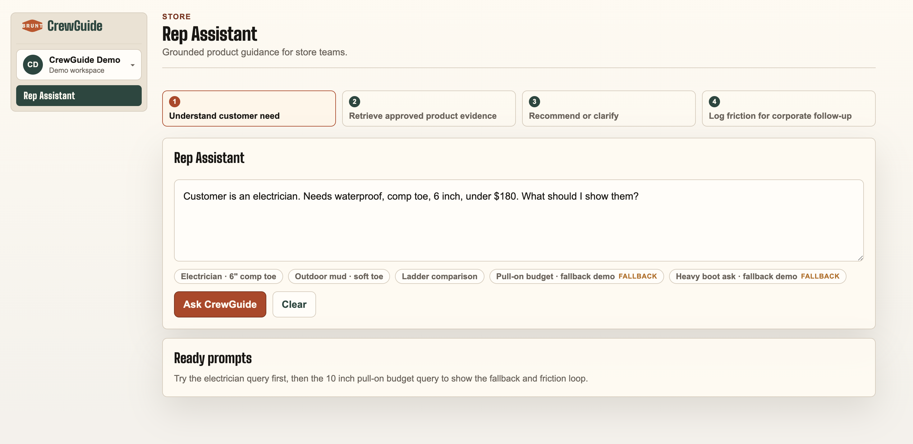
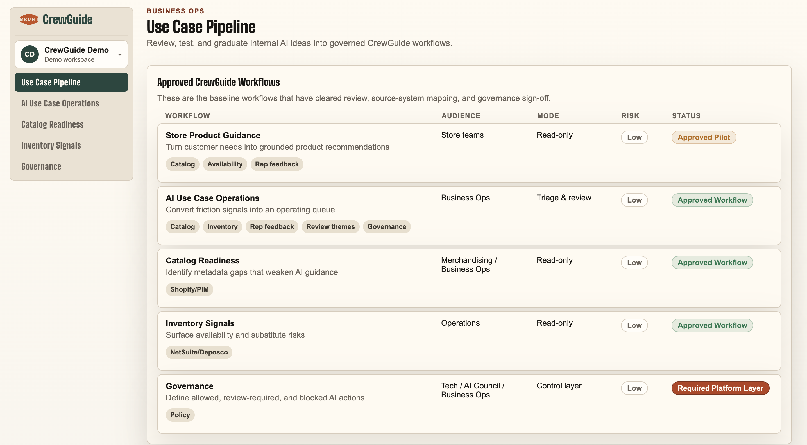
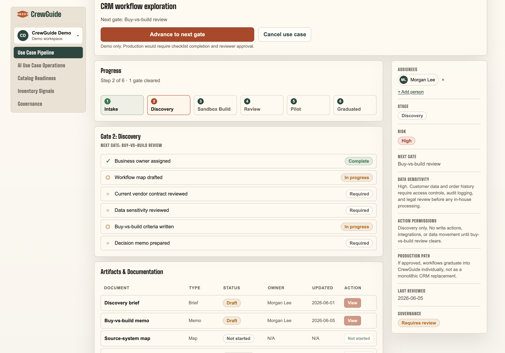
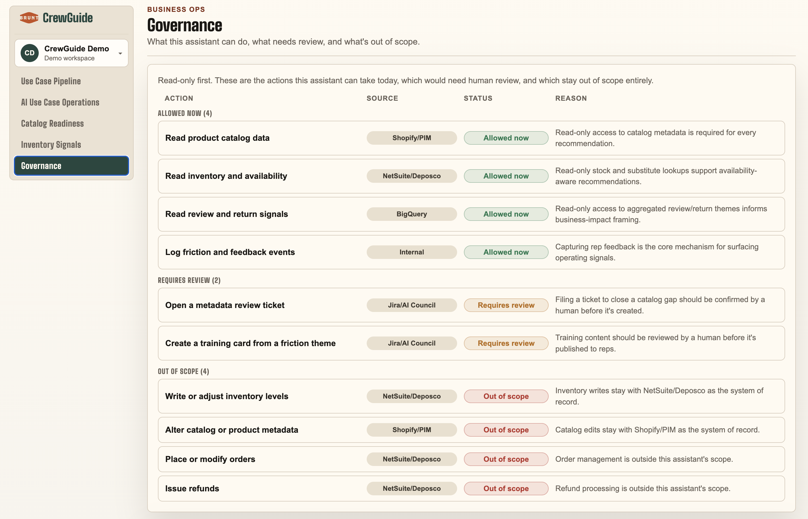
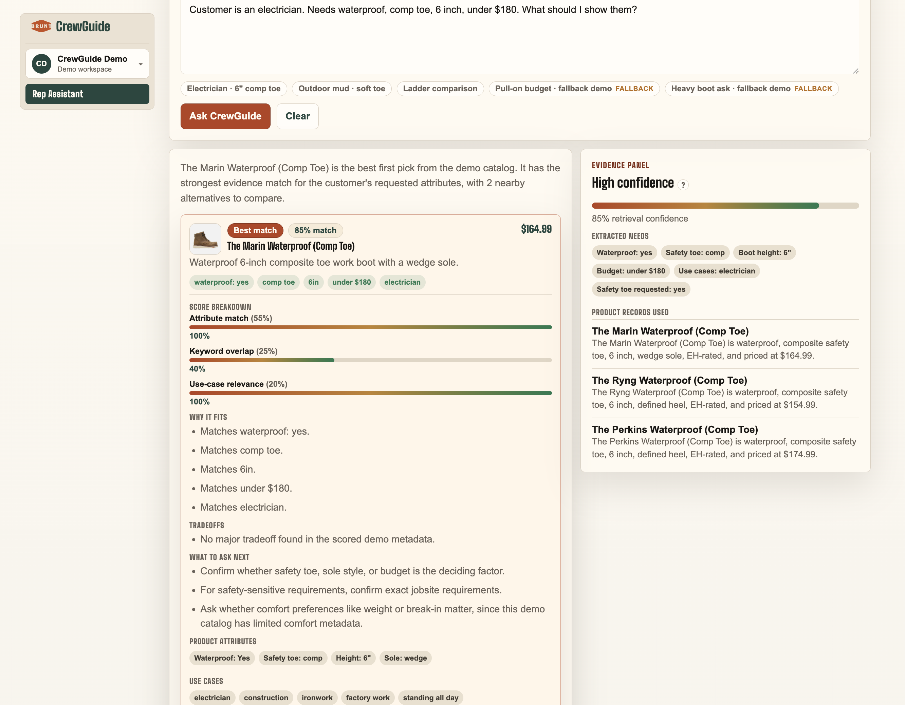
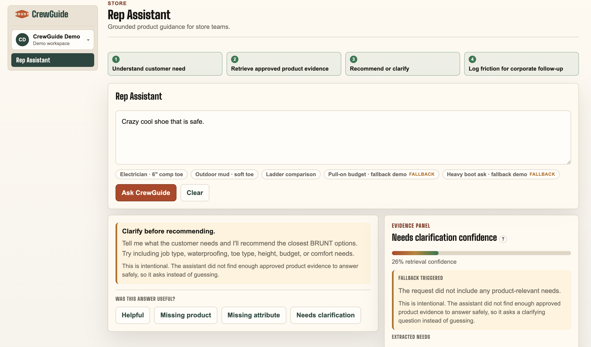

# BRUNT CrewGuide AI

CrewGuide AI is a scoped internal workflow demo for BRUNT. It shows how store reps could turn natural-language customer needs into grounded product guidance, and how BRUNT could route AI prototypes through a governed Business Ops workflow before they become real internal tools.

The Store Rep Assistant is the first concrete workflow. The larger idea is the operating model around it: ownership, source-system mapping, evaluations ("evals"), review gates, monitoring, and governance for AI workflows.

## Live demo

- Live demo: [Vercel link]
- GitHub: [GitHub link]

## What this demo is

CrewGuide is a scoped product demo. It does not use BRUNT internal systems, live inventory, real customer data, or a live LLM provider.

The demo uses a curated and very limited public BRUNT catalog slice, seeded operational data, deterministic retrieval/scoring logic, and a mock synthesis provider so the behavior is repeatable and inspectable.

The goal is not to claim this is production-ready. The goal is to show the shape of a production path: approved data sources, typed contracts, grounded retrieval, fallback behavior, evals, feedback loops, and governance.

## Why I built it

I built this after conversations with Joe McLauchlan and Dylan O'Connor. The store rep product guidance problem felt like a useful first workflow: a rep should not have to dig through the full catalog to answer a customer’s product-fit question.

The second idea came from the Claude Code discussion. Claude Code is great for fast internal prototypes, but production workflows still need structure. Without a shared path, prototypes can end up with unclear ownership, unclear data access, no evals, no approval gates, and no monitoring.

CrewGuide shows both sides: one concrete AI workflow for store reps, and the Business Ops layer that helps decide which AI ideas are safe, useful, and ready to become real internal tools.

## What this demo shows

CrewGuide is structured as an internal AI workflow shell, not just a chatbot. The Store side shows the first concrete workflow for rep product guidance. The Business Ops side shows how AI ideas are reviewed, governed, and prepared for production.

## AI workflow pipeline

The pipeline tracks AI ideas from discovery through sandbox, review, pilot, and approved workflow. Each idea has an owner, stage, risk level, source systems, and a next gate so prototypes do not become unmanaged one-off tools.

This is the part of the demo that connects most directly to internal AI adoption. Claude Code can help teams move quickly, but the company still needs a way to decide what should stay experimental, what needs review, and what can safely move toward production.

## Review workspace

The review workspace turns an AI idea into a controlled implementation path. Before a workflow can advance, the team should know the owner, source systems, acceptance criteria, eval expectations, risk profile, and approval requirements.

This mirrors the kind of process maturity needed when fast-moving engineering work becomes enterprise-facing: keep the team shipping, but make the work reviewable, auditable, monitorable, and safe to expand.

## Governance controls

Governance defines the rules of the road: what AI actions are allowed, what requires human review, what is blocked, and what evidence is needed before a workflow can move forward.

In this demo, governance is intentionally simple. The important pattern is that AI behavior should be categorized before production rollout. A read-only product assistant is very different from a workflow that writes to CRM, modifies orders, changes inventory, or sends customer-facing messages.

## Store workflow: grounded product guidance

The Store workflow is the first concrete use case inside the shell. CrewGuide extracts the customer’s needs, scores the catalog slice, and returns a grounded recommendation with tradeoffs and supporting evidence.

The important design choice is that the assistant does not treat the model as the source of truth. The catalog and scoring layer decide what products are eligible. The synthesis layer turns that structured result into rep-friendly guidance.

## Fallback and friction signals

Fallback is intentional. If the catalog cannot support the request, CrewGuide does not force a weak recommendation. It asks a clarifying question and turns the gap into a signal for Business Ops.

This matters because unanswered questions are not just failures. They can reveal missing metadata, training gaps, product-content issues, merchandising opportunities, or workflow needs.

## Architecture

CrewGuide has two connected systems:

1. **Governance and workflow layer**
   - AI use case intake
   - Ownership
   - Source-system mapping
   - Risk classification
   - Review gates
   - Eval expectations
   - Governance status
   - Production readiness

2. **Store recommendation workflow**
   - Query normalization
   - Product constraint extraction
   - Catalog scoring
   - Confidence and fallback logic
   - Evidence citations
   - Rep-facing synthesis
   - Friction logging

The key design choice is that the UI does not send raw text to a model and hope for the best. The system builds typed, inspectable recommendation and workflow objects first.

## Pipeline vs governance

The pipeline and governance are related, but they are not the same thing.

The pipeline answers:

- Where is this AI idea right now?
- Who owns it?
- What stage is it in?
- What source systems does it touch?
- What is the next gate?

Governance answers:

- Is this workflow allowed?
- Does it need human review?
- Can it write back to a system?
- What data can it access?
- What evals are required?
- What gets logged?
- Who approves it?

In other words, the pipeline is the process an AI idea moves through. Governance is the rule layer that decides whether the idea is allowed to move forward.

## Why the LLM is not the primary ranker

The synthesis layer is where an approved LLM provider would plug in. I intentionally separated that from scoring and ranking.

Product ranking should be deterministic, inspectable, and grounded in structured data. If the assistant recommends one boot over another, the team should be able to see why: waterproofing, toe type, height, price, sole type, use case, inventory, or safety rating.

In production, an LLM could help with natural-language synthesis, clarifying questions, summarizing tradeoffs, tool calling, or second-pass reranking among close candidates. But the catalog and scoring layer should remain the source of truth for product facts.

## Production path

In production, the seeded demo data would map to approved internal systems:

- Shopify or PIM for product catalog and product metadata.
- NetSuite or Deposco for inventory, fulfillment, and availability.
- BigQuery for review themes, operational analytics, and business signals.
- Vertex AI, Gemini, or Claude Enterprise for model access.
- Claude Code for fast internal prototyping, with CrewGuide acting as the governed path for workflows that should become real tools.
- Evals, monitoring, audit logs, access controls, and human feedback loops before production rollout.

## Project structure

The app is split so routing, UI, recommendation logic, governance logic, telemetry, and evals stay separate.

| Path | Purpose |
| --- | --- |
| `src/app` | Next.js routes and API entry points. |
| `src/components` | UI for the Store assistant, recommendation cards, evidence panel, feedback, mobile nav, and Business Ops views. |
| `src/lib/catalog` | Product contracts and the curated public BRUNT catalog slice. |
| `src/lib/retrieval` | Query normalization, product scoring, confidence, fallback logic, and citations. |
| `src/lib/ai` | AI provider boundary. The demo uses a deterministic mock provider. |
| `src/lib/intelligence` | Business Ops signals, catalog readiness, governance, and opportunity builders. |
| `src/lib/telemetry` | Rep feedback and friction event logging. |
| `src/lib/evals` | Product-guide evals for core recommendation behavior. |
| `docs/images` | README screenshots. |
| `public` | Static assets and local product images. |

## Run locally
npm install

npm run dev

## Example prompts
Customer is an electrician. Needs waterproof, comp toe, 6 inch, under $180. What should I show them?

Someone works outdoors in mud and wants waterproof but does not need safety toe. What are good options?

Compare Marin Waterproof Comp Toe and Ryng Waterproof Comp Toe for ladder work.

What product should I recommend for someone who wants a durable boot but complains about heavy footwear?

## What I would build next
1. **Real product feed ingestion**: sync the catalog from Shopify or PIM instead of seeded data.
2. **Inventory awareness**: pull NetSuite or Deposco availability by store, warehouse, size, and fulfillment path.
3. **Role-based access**: enforce Store and Business Ops views with identity, role claims, route guards, and API authorization.
4. **Workflow persistence**: store AI use case reviews, approval state, governance decisions, and audit events in a database.
5. **Eval set from real rep questions**: expand beyond synthetic cases using actual rep queries and friction events.
6. **Governed production path**: add model/version tracking, audit logs, monitoring, and approval gates.
7. **Read-only first, controlled actions later**: keep the assistant advisory until evals and governance support write actions.

